# ERIFY™ Cron Job Scheduling Guide

This guide provides visual documentation and ready-to-use templates for implementing cron job scheduling in ERIFY™ systems using Node.js (node-cron) and Cloudflare Workers (Scheduled Triggers).

## Visual Map of Job Timings

### Quick Reference Table

| Job | Schedule | Command/Core Action | Notes |
|-----|----------|-------------------|-------|
| Process moderation images | `* * * * *` (every minute) | `manage.py moderation_queue_process_queued_images` | Low priority via nice/ionice |
| Parse SOPN raw data | `* * * * *` (every minute) | `manage.py sopn_parsing_process_unparsed` | Single-run guard via flock |
| Update parties from EC | `06 02 * * *` | `manage.py parties_import_from_ec --post-to-slack` | Daily 02:06 |
| Look for recent EE changes | `*/5 * * * *` | `manage.py uk_create_elections_from_every_election --recently-updated` | Every 5 minutes |
| Check for current elections | `23 23 * * *` | `manage.py uk_create_elections_from_every_election --check-current` | Nightly check |
| Mop up missed elections | `33 23 * * *` | `manage.py uk_create_elections_from_every_election --recently-updated --recently-updated-delta 25` | Nightly retry sweep |

**Commented (inactive but documented):** Twitter username update, add Twitter images, build static person pages, update party current candidates, full EE import.

### Mermaid Timeline

```mermaid
gantt
    title YNR Cron — Daily Rhythm (Africa/Lagos)
    dateFormat HH:mm
    axisFormat %H:%M
    section Frequent
    EE recently-updated (every 5m)     :active, a1, 00:00, 24h
    Mod queue images (low prio)        :a2, 00:00, 24h
    SOPN parse (flocked)               :a3, 00:00, 24h
    section Nightly
    Parties from EC                    :b1, 02:06, 5m
    Check current elections            :b2, 23:23, 5m
    Mop up missed elections            :b3, 23:33, 5m
```



## Implementation Templates

### Node.js Template (node-cron)

See [Node.js Implementation](./templates/nodejs-cron/) for complete setup files.

### Cloudflare Workers Template

See [Cloudflare Workers Implementation](./templates/cloudflare-workers/) for complete setup files.

## Deployment Options

### PM2 (Process Manager)
```bash
pm2 start scheduler.js --name erify-cron
pm2 save
pm2 startup
```

### Systemd Service
Create a systemd service file for production deployments.

### Docker Container
Use the provided Dockerfile for containerized deployments.

## Observability & Monitoring

- **Logging**: Configure structured logging with Pino
- **Heartbeat**: Set up health checks with UptimeKuma/Healthchecks.io
- **Alerts**: Configure email/Slack notifications for failed jobs
- **Metrics**: Track job execution times and success rates

## Security Considerations

- Use secure tokens for API endpoints
- Implement rate limiting on cron endpoints
- Use Redis/database locks for distributed environments
- Validate all input parameters and sanitize commands

## Migration from Traditional Cron

1. Map existing crontab entries to new scheduling system
2. Test job execution in staging environment
3. Implement gradual rollout with monitoring
4. Keep fallback cron jobs until fully validated