# ERIFY™ Cron Scheduling Documentation

Say less, Chief — I'll deliver both: a clean visual map you can drop in docs, plus ready-to-use
templates for Node.js (node-cron) and Cloudflare Workers (Scheduled Triggers). You can
paste-and-run, then tweak paths.

⸻

## Visual Map of Job Timings

### Quick table (copy into README)

| Job                         | Schedule                            | Command/Core Action                                                                                | Notes                        |
| --------------------------- | ----------------------------------- | -------------------------------------------------------------------------------------------------- | ---------------------------- |
| Process moderation images   | `* * * * *` (implicit every minute) | `manage.py moderation_queue_process_queued_images`                                                 | Low priority via nice/ionice |
| Parse SOPN raw data         | `* * * * *` (implicit every minute) | `manage.py sopn_parsing_process_unparsed`                                                          | Single-run guard via flock   |
| Update parties from EC      | `06 02 * * *`                       | `manage.py parties_import_from_ec --post-to-slack`                                                 | Daily 02:06                  |
| Look for recent EE changes  | `*/5 * * * *`                       | `manage.py uk_create_elections_from_every_election --recently-updated`                             | Every 5 minutes              |
| Check for current elections | `23 23 * * *`                       | `manage.py uk_create_elections_from_every_election --check-current`                                | Nightly check                |
| Mop up missed elections     | `33 23 * * *`                       | `manage.py uk_create_elections_from_every_election --recently-updated --recently-updated-delta 25` | Nightly retry sweep          |

**Commented (inactive but documented):** Twitter username update, add Twitter images, build static
person pages, update party current candidates, full EE import.

### Mermaid timeline (drop into docs sites that render Mermaid)

```mermaid
gantt
    title YNR Cron — Daily Rhythm (Africa/Lagos)
    dateFormat HH:mm
    axisFormat %H:%M
    section Frequent
    EE recently-updated (every 5m)     :active, a1, 00:00, 24h
    Mod queue images (low prio)        :a2, 00:00, 24h
    SOPN parse (flocked)               :a3, 00:00, 24h
    section Nightly
    Parties from EC                    :b1, 02:06, 5m
    Check current elections            :b2, 23:23, 5m
    Mop up missed elections            :b3, 23:33, 5m
```

⸻

## Available Templates

### 🚀 [Node.js Template](./nodejs/)

Complete Node.js implementation using `node-cron` for scheduling Django management commands.
Includes process locking, nice/ionice support, and PM2 configuration.

### ☁️ [Cloudflare Workers Template](./cloudflare-workers/)

Serverless implementation using Cloudflare Workers Scheduled Triggers. Calls secure HTTP endpoints
in your Django backend.

⸻

## Extras & Parity Notes

- **nice/ionice parity:** Not available on Workers; on Node VM, use the `USE_NICE` flag shown. For
  containers, also set cgroup CPU/IO shares.
- **flock parity:** Use Redis locks (best) or proper-lockfile (local disk). For distributed runs,
  prefer Redis/MQ-based locks.
- **MAILTO/emailing:** Stream logs to your stack (PM2 + Papertrail/CloudWatch/Logtail). For "on
  error, email," add a Pino transport that emails only on non-2xx.
- **Observability:** Add a "heartbeat" ping from each job run to UptimeKuma/Healthchecks.io so you
  can alert on missed runs.

⸻

## Next Steps

If you want, we can bundle this into a mini repo (/scheduler folder with README and Dockerfile) or
wire it into your existing ERIFY repos with CI. Want us to package it as:

- A PM2 ecosystem file + service docs, or
- A Wrangler project scaffold with secrets instructions?
