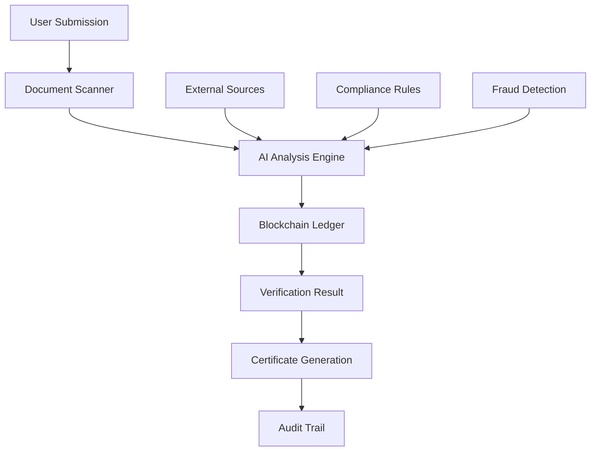

# AVERIZY™ Overview ✅💎

**Luxury Verification Platform — Trust, verified with diamond-level security**

AVERIZY™ is ERIFY™'s enterprise-grade verification platform that delivers trust through cutting-edge security, seamless user experiences, and luxury-level attention to detail. When verification matters, AVERIZY™ delivers.

## ✨ Core Features

### 🛡️ Diamond-Level Security
- **Multi-factor authentication** with biometric support
- **Zero-knowledge verification** for privacy protection
- **Blockchain-backed certificates** for immutable trust
- **Real-time fraud detection** with AI monitoring

### 🎯 Identity Verification
- **Document verification** with AI-powered analysis
- **Facial recognition** with liveness detection
- **Address verification** through multiple sources
- **Professional credentials** and certifications

### 🌐 Business Verification
- **Company registration** validation
- **Financial standing** verification
- **Compliance checking** for regulatory requirements
- **API integrations** for seamless workflows

## 💼 Enterprise Solutions

### KYC/AML Compliance
```javascript
// AVERIZY™ KYC Integration
import { AVERIZY } from '@erify/averizy-sdk';

const verifier = new AVERIZY({
  apiKey: 'your-api-key',
  compliance: 'KYC-AML-GDPR'
});

const result = await verifier.verifyIdentity({
  documentType: 'passport',
  documentImage: documentBase64,
  selfieImage: selfieBase64,
  additionalData: {
    address: userAddress,
    phone: userPhone
  }
});

if (result.verified) {
  console.log('✅ Verification successful');
  console.log('Trust score:', result.trustScore);
} else {
  console.log('❌ Verification failed:', result.reasons);
}
```

### Financial Services
- **Customer onboarding** with streamlined KYC
- **Transaction monitoring** for suspicious activity
- **Credit scoring** with alternative data sources
- **Regulatory reporting** automation

### Healthcare & Legal
- **Professional licensing** verification
- **Patient identity** confirmation
- **Legal document** authentication
- **Compliance auditing** trails

## 🏗️ Architecture

AVERIZY™ uses a distributed, secure architecture:



## 🚀 Verification Types

### Personal Identity
- **Government IDs** (Passport, Driver's License, National ID)
- **Biometric verification** (Face, Fingerprint, Voice)
- **Address proof** (Utility bills, Bank statements)
- **Phone & Email** verification

### Business Verification
- **Company registration** documents
- **Tax identification** numbers
- **Professional licenses** and certifications
- **Financial statements** and credit reports

### Digital Verification
- **Social media** profile authentication
- **Digital signatures** and certificates
- **Cryptocurrency** wallet verification
- **Domain ownership** verification

## 🎨 User Experience

AVERIZY™ prioritizes user experience without compromising security:

### Seamless Flow
```typescript
// Simple verification flow
const verification = await averizy.createSession({
  type: 'identity',
  requirements: ['document', 'selfie'],
  ui: {
    theme: 'luxury',
    branding: 'custom',
    language: 'auto-detect'
  }
});

// Redirect user to verification URL
window.location.href = verification.verificationUrl;
```

### Mobile-First Design
- **Progressive web app** for any device
- **Camera integration** for document capture
- **Offline capability** for remote areas
- **Accessibility features** for all users

## 📊 Analytics & Reporting

### Real-Time Dashboard
- **Verification metrics** and success rates
- **Fraud detection** alerts and trends
- **Compliance reporting** for auditors
- **Performance analytics** and optimization

### API Monitoring
```javascript
// Get verification analytics
const analytics = await averizy.getAnalytics({
  timeframe: '30-days',
  metrics: ['success-rate', 'fraud-detected', 'processing-time']
});

console.log('Success rate:', analytics.successRate);
console.log('Average processing time:', analytics.avgProcessingTime);
```

## 🌍 Global Compliance

AVERIZY™ supports international verification standards:

- **GDPR** (European Union)
- **CCPA** (California)
- **SOX** (Sarbanes-Oxley)
- **PCI DSS** (Payment Card Industry)
- **HIPAA** (Healthcare)
- **ISO 27001** (Information Security)

## 🔗 Integration Examples

### E-commerce Platform
```typescript
// Verify seller before account approval
app.post('/seller/onboard', async (req, res) => {
  const verification = await averizy.verifyBusiness({
    businessName: req.body.businessName,
    registrationNumber: req.body.registrationNumber,
    ownerDocument: req.body.ownerDocument,
    requirements: ['business-registration', 'tax-id', 'owner-identity']
  });
  
  if (verification.approved) {
    // Approve seller account
    await approveSellerAccount(req.body.sellerId);
  }
});
```

### Financial Application
```typescript
// KYC verification for loan application
const kycResult = await averizy.performKYC({
  applicantId: userId,
  documents: {
    identity: identityDocument,
    income: incomeProof,
    address: addressProof
  },
  biometrics: {
    face: faceImage,
    voice: voiceSample
  }
});
```

## 🚀 Getting Started

Ready to implement trust in your platform?

1. [Start verification process](./verification-process) - Learn the complete flow
2. [API Reference](./api-reference) - Explore all endpoints
3. [Security Guide](./security) - Understand our security model
4. [Integration Examples](./examples) - See real implementations

---

💎 *AVERIZY™ — Where trust meets technology*