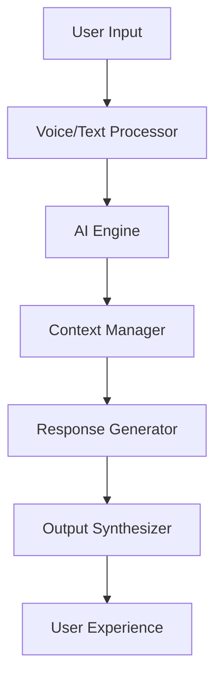

# ERIVOX™ Overview 🗣💠

**Intelligent Voice & Text Assistant — Where AI meets luxury conversation**

ERIVOX™ is ERIFY™'s flagship AI assistant that combines cutting-edge voice processing with seamless text integration. Built for the future of human-AI interaction, ERIVOX™ understands context, emotion, and intent like never before.

## ✨ Key Features

### 🎙️ Advanced Voice Processing
- **Natural conversation flow** with emotional intelligence
- **Multi-language support** with accent recognition
- **Real-time voice synthesis** with customizable personas
- **Noise cancellation** and audio enhancement

### 💬 Intelligent Text Integration
- **Context-aware responses** that maintain conversation flow
- **Rich text formatting** with markdown support
- **Code generation** and technical assistance
- **Creative writing** and content creation

### 🧠 AI-Powered Intelligence
- **Learning from interactions** to improve over time
- **Personalized responses** based on user preferences
- **Cross-platform synchronization** for seamless experiences
- **Enterprise-grade security** with end-to-end encryption

## 🎯 Use Cases

### For Developers
```javascript
// ERIVOX™ SDK Example
import { ERIVOX } from '@erify/erivox-sdk';

const assistant = new ERIVOX({
  apiKey: 'your-api-key',
  voiceProfile: 'luxury-professional'
});

// Voice interaction
await assistant.startVoiceSession({
  onResponse: (text, audio) => {
    console.log('ERIVOX™ response:', text);
    // Play audio response
  }
});
```

### For Businesses
- **Customer service automation** with human-like interactions
- **Meeting transcription** and action item extraction
- **Content creation** for marketing and documentation
- **Voice-controlled applications** and interfaces

### For Creators
- **Podcast editing** and content enhancement
- **Script writing** and creative assistance
- **Voice-over generation** for multimedia projects
- **Interactive storytelling** experiences

## 🏗️ Architecture

ERIVOX™ is built on a modern, scalable architecture:



## 🚀 Getting Started

Ready to integrate ERIVOX™ into your projects?

1. [Sign up for API access](./getting-started)
2. [Explore voice commands](./voice-commands)
3. [Check out integrations](./integrations)
4. [Join the developer community](https://github.com/erify-world/erivox)

---

💠 *ERIVOX™ — Intelligence that speaks your language*